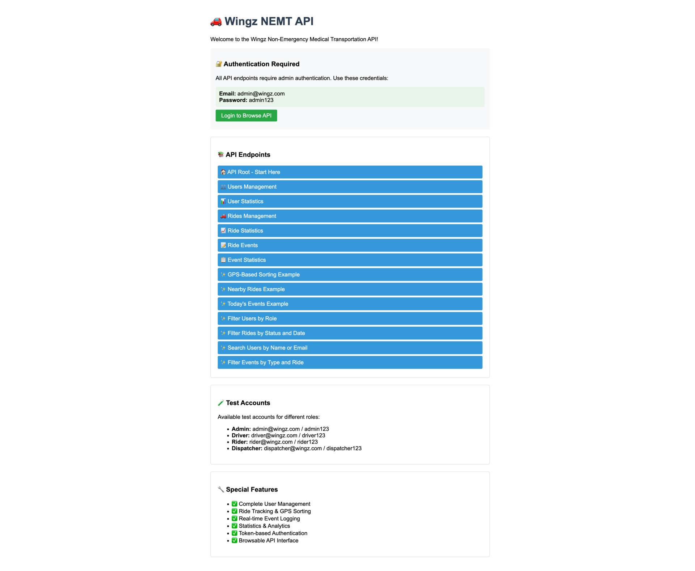
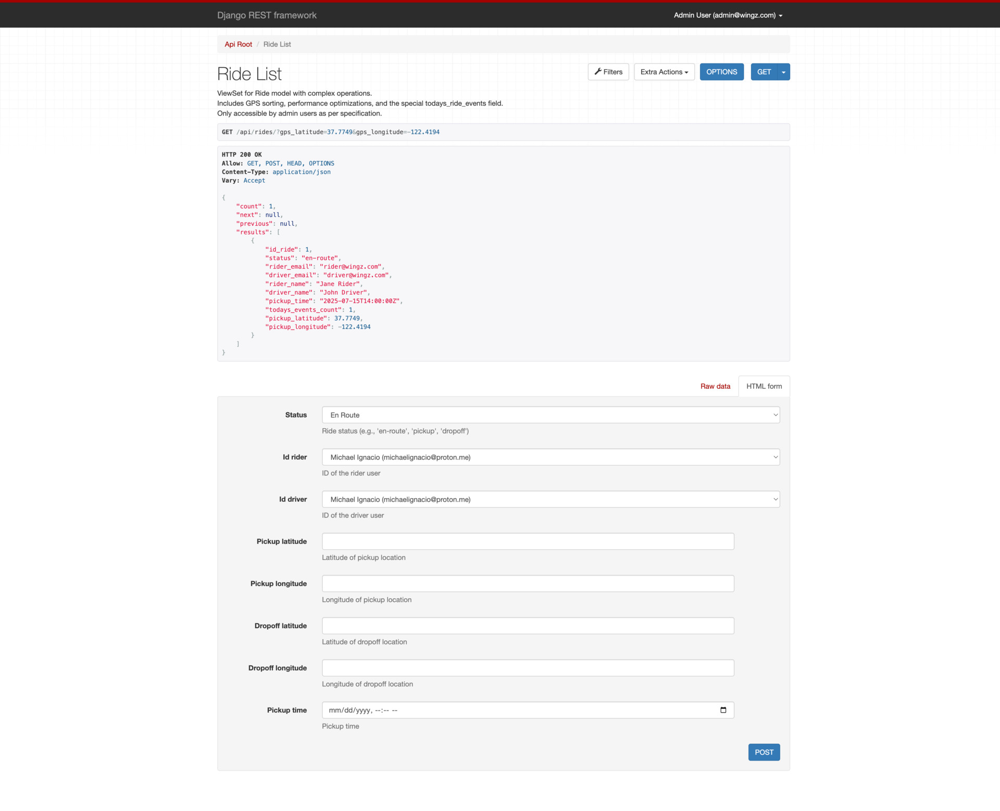

# Wingz NEMT - Django REST API

A RESTful API for managing ride information using Django REST Framework.



## Prerequisites

- Python 3.13+
- PostgreSQL 12+
- pipenv

## Database Setup

### PostgreSQL Installation

**macOS (with Homebrew):**
```bash
brew install postgresql
brew services start postgresql
```

**Ubuntu/Debian:**
```bash
sudo apt update
sudo apt install postgresql postgresql-contrib
sudo systemctl start postgresql
sudo systemctl enable postgresql
```

### Database Creation

1. Connect to PostgreSQL as superuser:
```bash
psql postgres
```

2. Create database and user:
```sql
CREATE DATABASE wingz_nemt_dev;
CREATE USER postgres WITH PASSWORD 'password';
GRANT ALL PRIVILEGES ON DATABASE wingz_nemt_dev TO postgres;
\q
```

## Project Setup

1. Clone the repository and navigate to project directory
2. Install dependencies:
```bash
pipenv install
```

3. Activate virtual environment:
```bash
pipenv shell
```

4. Copy environment variables:
```bash
cp .env.example .env
```

5. Update `.env` with your database credentials if different from defaults

6. Run migrations:
```bash
python manage.py migrate
```

7. Create superuser:
```bash
python manage.py createsuperuser
```

8. Start development server:
```bash
python manage.py runserver
```


9. Create test users (admin and test accounts):
```bash
python manage.py create_test_users --create-admin --create-test-users
```
This will create the admin and test accounts described in this README for local development and testing.

10. Populate test data (users, rides, and ride events):
```bash
python manage.py populate_test_data
```
This will create additional dispatcher, test users, rides, and ride events for local development and testing.


## Environment Variables

- `DEBUG`: Set to `True` for development, `False` for production
- `DATABASE_URL`: PostgreSQL connection string

## API Documentation



## Special Features

### [GPS-Based Sorting](#gps-based-sorting)
Add GPS parameters to ride list to sort by distance:
```bash
GET /api/rides/?gps_latitude=37.7749&gps_longitude=-122.4194
```

### [Nearby Rides](#nearby-rides)
Find rides within a radius (default 10km):
```bash
GET /api/rides/nearby/?gps_latitude=37.7749&gps_longitude=-122.4194&radius=5
```

### [Today's Events (Performance Optimized)](#todays-events-performance-optimized)
Get events from last 24 hours with pagination:
```bash
GET /api/ride-events/todays_events/
```

### [Filtering Examples](#filtering-examples)
```bash
# Filter users by role
GET /api/users/?role=driver&is_active=true

# Filter rides by status and date
GET /api/rides/?status=active&start_date=2025-01-01

# Search users by name or email
GET /api/users/?search=john

# Filter events by type and ride
GET /api/ride-events/?event_type=pickup&ride_id=123
```
The API provides admin-only access to ride management with the following features:

- Ride List API with pagination, filtering, and sorting
- Performance optimized queries
- GPS-based distance sorting
- Real-time ride events tracking

### Authentication

All endpoints require admin authentication. Only users with 'admin' role can access the API.

**Get Token:**
```bash
POST /api/auth/token/
Content-Type: application/json

{
    "username": "admin@example.com",
    "password": "your_password"
}
```

**Use Token in Headers:**
```bash
Authorization: Token your_token_here
```

### API Endpoints

#### User Management
- `GET /api/users/` - List all users (with filtering, search, pagination)
- `POST /api/users/` - Create new user
- `GET /api/users/{id}/` - Get specific user details
- `PUT /api/users/{id}/` - Update user (full update)
- `PATCH /api/users/{id}/` - Partial update user
- `DELETE /api/users/{id}/` - Deactivate user (soft delete)
- `POST /api/users/{id}/activate/` - Reactivate deactivated user
- `GET /api/users/drivers/` - Get all active drivers
- `GET /api/users/riders/` - Get all active riders
- `GET /api/users/{id}/rides/` - Get all rides for specific user
- `GET /api/users/stats/` - Get user statistics dashboard

#### Ride Management
- `GET /api/rides/` - List rides (supports GPS sorting, filtering, pagination)
- `POST /api/rides/` - Create new ride
- `GET /api/rides/{id}/` - Get specific ride with events
- `PUT /api/rides/{id}/` - Update ride (full update)
- `PATCH /api/rides/{id}/` - Partial update ride
- `DELETE /api/rides/{id}/` - Delete ride
- `GET /api/rides/nearby/` - Find rides near GPS coordinates
- `GET /api/rides/{id}/events/` - Get all events for specific ride
- `GET /api/rides/active/` - Get all active (non-completed) rides
- `GET /api/rides/stats/` - Get ride statistics dashboard

#### Ride Event Management
- `GET /api/ride-events/` - List ride events (with filtering, search, pagination)
- `POST /api/ride-events/` - Create new ride event
- `GET /api/ride-events/{id}/` - Get specific ride event
- `PUT /api/ride-events/{id}/` - Update ride event (full update)
- `PATCH /api/ride-events/{id}/` - Partial update ride event
- `DELETE /api/ride-events/{id}/` - Delete ride event
- `GET /api/ride-events/todays_events/` - Get today's events (performance optimized)
- `GET /api/ride-events/by_ride/?ride_id={id}` - Get events for specific ride
- `GET /api/ride-events/event_types/` - Get all unique event types
- `GET /api/ride-events/stats/` - Get ride event statistics

### Special Features

#### GPS-Based Sorting
Add GPS parameters to ride list to sort by distance:
```bash
GET /api/rides/?gps_latitude=37.7749&gps_longitude=-122.4194
```

#### Nearby Rides
Find rides within a radius (default 10km):
```bash
GET /api/rides/nearby/?gps_latitude=37.7749&gps_longitude=-122.4194&radius=5
```

#### Today's Events (Performance Optimized)
Get events from last 24 hours with pagination:
```bash
GET /api/ride-events/todays_events/
```

#### Filtering Examples
```bash
# Filter users by role
GET /api/users/?role=driver&is_active=true

# Filter rides by status and date
GET /api/rides/?status=active&start_date=2025-01-01

# Search users by name or email
GET /api/users/?search=john

# Filter events by type and ride
GET /api/ride-events/?event_type=pickup&ride_id=123
```

### Interactive API Browser

Visit `/api/` in your browser after starting the server to access Django REST Framework's interactive API browser for testing endpoints.

## Development

This project follows Django best practices and includes:

- Environment-based configuration
- PostgreSQL for both development and production
- Comprehensive error handling
- Performance optimizations for large datasets
